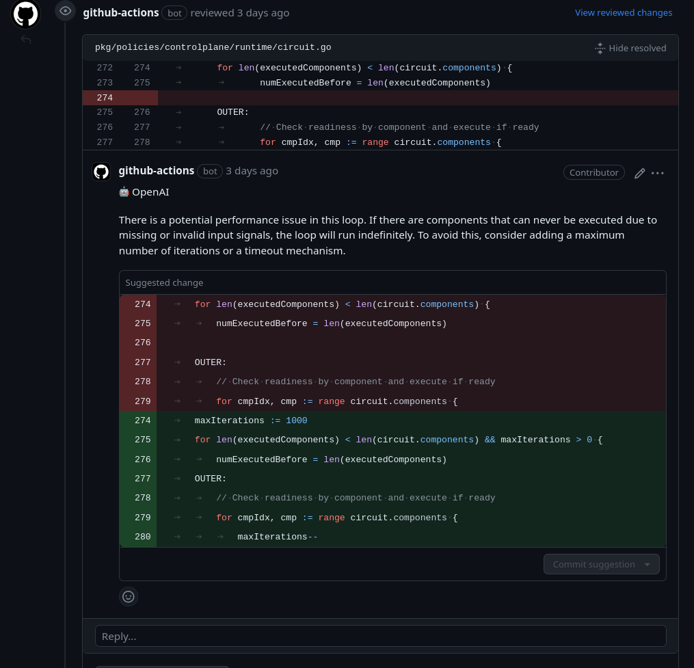
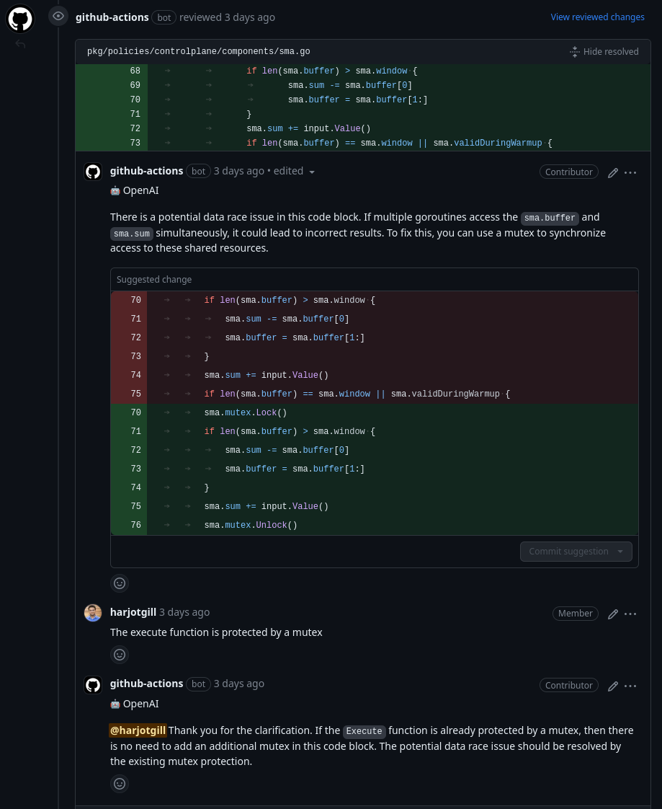

# OpenAI ChatGPT-based PR reviewer and summarizer


## Overview

This [OpenAI ChatGPT-based](https://platform.openai.com/docs/guides/chat) GitHub
Action provides a summary, release notes and review of pull requests. The unique
features of this action are:

- **Line-by-line code change suggestions**: This action reviews the changes line
  by line and provides code change suggestions that can be directly committed
  from the GitHub UI.
- **Continuous, incremental reviews**: Reviews are performed on each commit
  within a pull request, rather than a one-time review on the entire pull
  request.
- **Cost-effective and reduced noise**: Incremental reviews save on OpenAI costs
  and reduce noise by tracking changed files between commits and the base of the
  pull request.
- **"Light" model for summary**: Designed to be used with a "light"
  summarization model (e.g. `gpt-3.5-turbo`) and a "heavy" review model (e.g.
  `gpt-4`). _For best results, use `gpt-4` as the "heavy" model, as thorough
  code review needs strong reasoning abilities._
- **Chat with bot**: Supports conversation with the bot in the context of lines
  of code or entire files, useful for providing context, generating test cases,
  and reducing code complexity.
- **Smart review skipping**: By default, skips in-depth review for simple
  changes (e.g. typo fixes) and when changes look good for the most part. It can
  be disabled by setting `review_simple_changes` and `review_comment_lgtm` to
  `true`.
- **Customizable prompts**: Tailor the `system_message`, `summarize`, and
  `summarize_release_notes` prompts to focus on specific aspects of the review
  process or even change the review objective.

## Usage

Add the below file to your repository at
`.github/workflows/openai-pr-reviewer.yml`

```yaml
name: Code Review

permissions:
  contents: read
  pull-requests: write

on:
  pull_request:
  pull_request_review_comment:
    types: [created]

concurrency:
  group:
    ${{ github.repository }}-${{ github.event.number || github.head_ref ||
    github.sha }}-${{ github.workflow }}-${{ github.event_name ==
    'pull_request_review_comment' && 'pr_comment' || 'pr' }}
  cancel-in-progress: ${{ github.event_name != 'pull_request_review_comment' }}

jobs:
  review:
    runs-on: ubuntu-latest
    steps:
      - uses: symphco/raven-pr-reviewer@latest
        env:
          GITHUB_TOKEN: ${{ secrets.GITHUB_TOKEN }}
          OPENAI_API_KEY: ${{ secrets.OPENAI_API_KEY }}
        with:
          debug: false
          review_simple_changes: false
          review_comment_lgtm: false
```

### Conversation with OpenAI

You can reply to a review comment made by this action and get a response based
on the diff context. Additionally, you can invite the bot to a conversation by
tagging it in the comment (`@openai`).

Example:

> @raven Please generate a test plan for this file.

Note: A review comment is a comment made on a diff or a file in the pull
request.

### Ignoring PRs

Sometimes it is useful to ignore a PR. For example, if you are using this action
to review documentation, you can ignore PRs that only change the documentation.
To ignore a PR, add the following keyword in the PR description:

```text
@openai: ignore
```

### Screenshots






#### Environment variables

- `GITHUB_TOKEN`: This should already be available to the GitHub Action
  environment. This is used to add comments to the pull request.
- `OPENAI_API_KEY`: use this to authenticate with OpenAI API. You can get one
  [here](https://platform.openai.com/account/api-keys). Please add this key to
  your GitHub Action secrets.

### Models: `gpt-4` and `gpt-3.5-turbo`

We use `gpt-3.5-turbo` for lighter tasks such as summarizing the
changes (`openai_light_model` in configuration) and `gpt-4` for more complex
review and commenting tasks (`openai_heavy_model` in configuration).

Costs: `gpt-3.5-turbo` is dirt cheap. `gpt-4` is orders of magnitude more
expensive, but the results are vastly superior. We are typically spending $20 a
day for a 20 developer team with `gpt-4` based review and commenting.

### Prompts & Configuration

See: [action.yml](./action.yml)

Tip: You can change the bot personality by configuring the `system_message`
value. For example, to review docs/blog posts, you can use the following prompt:

<details>
<summary>Reviewer Prompt</summary>

```yaml
system_message: |
  You are `@Raven` (aka `Raven[bot]`), a language model 
  trained by OpenAI. Your purpose is to act as a highly experienced 
  senior software engineer and provide a thorough review of the code hunks
  and suggest code snippets to improve key areas such as:
    - Logic
    - Security
    - Performance
    - Data races
    - Consistency
    - Error handling
    - Maintainability
    - Modularity
    - Complexity
    - Optimization

  Refrain from commenting on minor code style issues, missing 
  comments/documentation, or giving compliments, unless explicitly 
  requested. Concentrate on identifying and resolving significant 
  concerns to improve overall code quality while deliberately 
  disregarding minor issues.

  Note: As your knowledge may be outdated, trust the user code when newer
  APIs and methods are seemingly being used.
```

</details>
